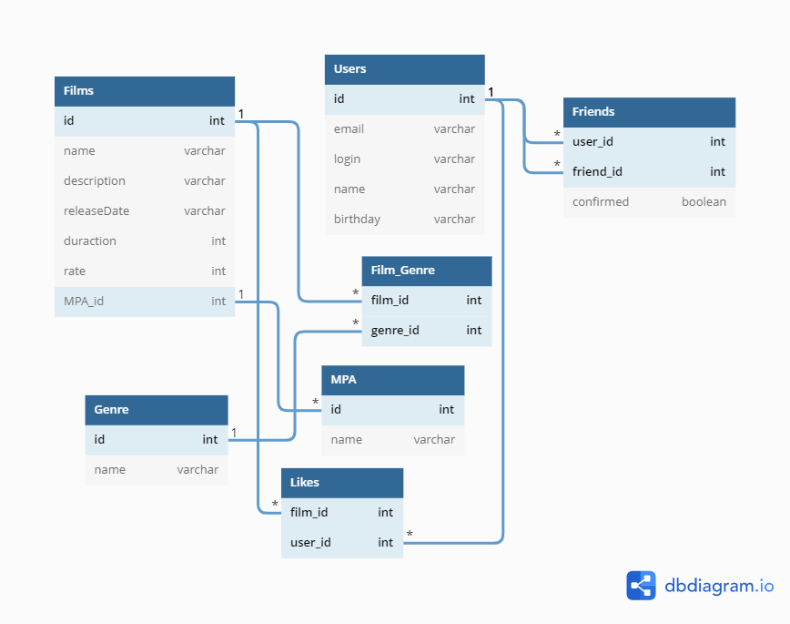

# Filmorate
## Tables `for project`.

Tap to [***link***](https://dbdiagram.io/d/62b2c26869be0b672c196876) 
for open in browser or see picture 



## Some commands for querying the database
Create User
```
INSERT INTO Users (email, login, name, birthday)
VALUES ('a@mail.ru', 'test', 'Test' '1999-06-23'); 
```
GetAllUsers
```
SELECT * FROM Users
```

GetUserById
```
SELECT * FROM Users WHERE id=?
```

GetFriendsByUserId
```
SELECT * 
FROM Users
WHERE id = (
    SELECT user_id 
    FROM Friends 
    WHERE id = ?
)
```